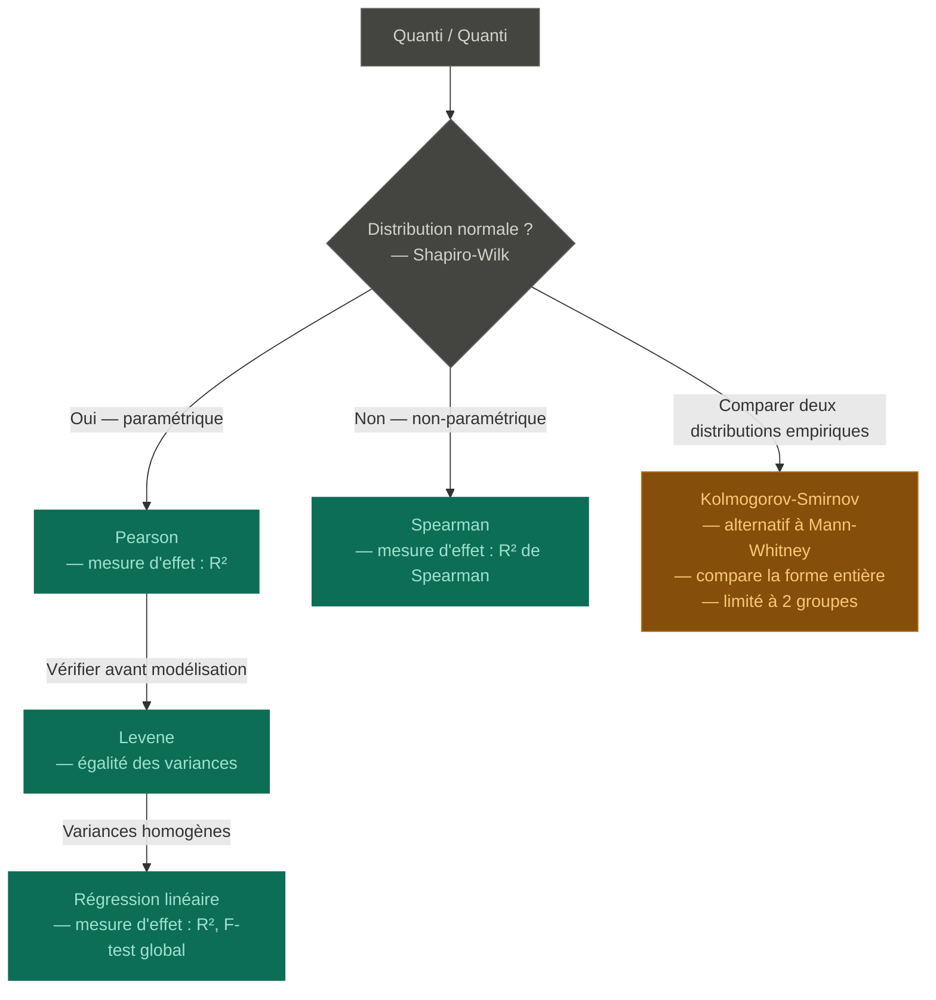
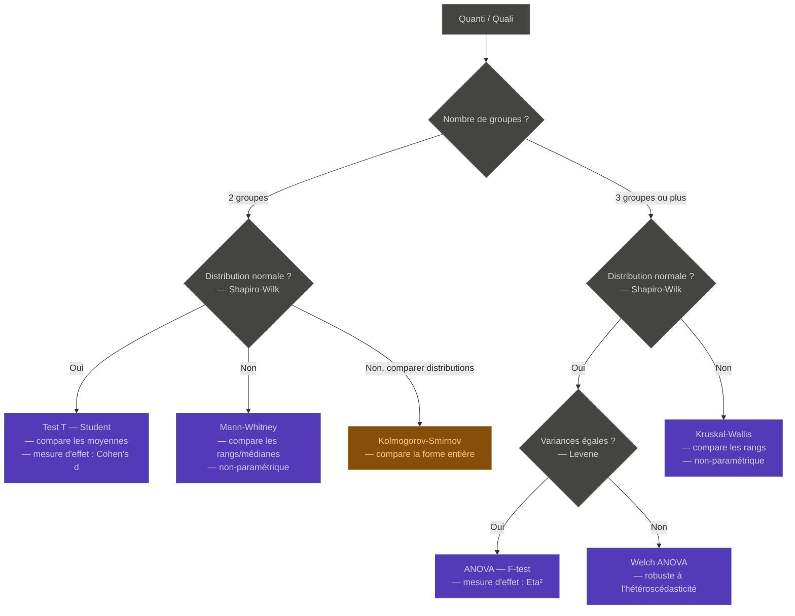
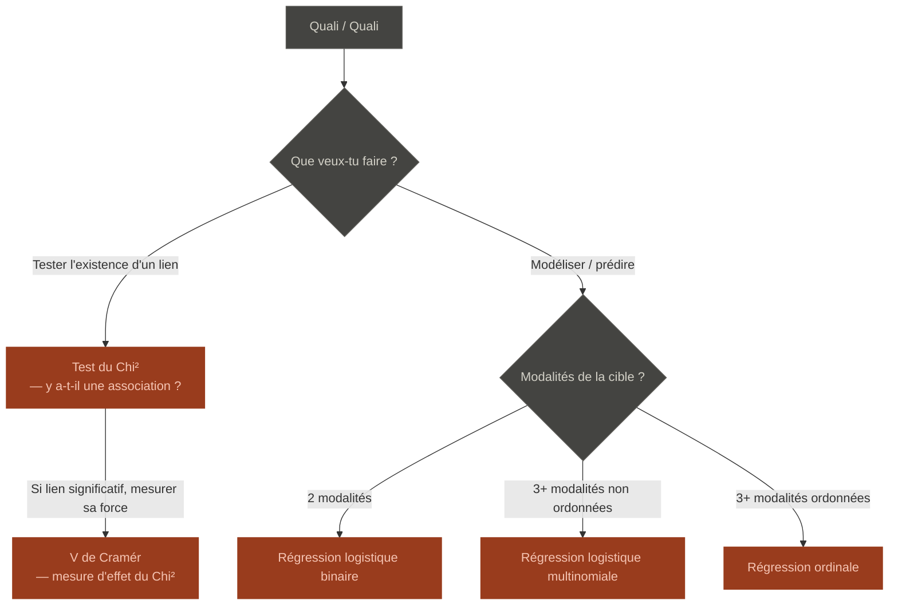

# Arborescence des tests statistiques

---

## 🎯 Usages courants — Data Analyst & Dev IA

### En Data Analyse (quotidien)

| Situation | Test à utiliser | Corrélation |
|---|---|---|
| Explorer le lien entre deux variables numériques | Pearson (normal) ou Spearman (non-param.) | Quanti / Quanti
| Comparer deux groupes sur une mesure | Test T (normal) ou Mann-Whitney (non-param.) | Quanti / Quali
| Croiser deux variables catégorielles | Chi² + V de Cramér | Quali / Quali
| Comparer plusieurs groupes sur une mesure | ANOVA (normal) ou Kruskal-Wallis (non-param.) | Quanti / Quali
| Vérifier si les variances sont comparables | Levene | Pré requis ANOVA

### En Dev IA / ML (formation et projets)

| Situation | Test à utiliser |
|---|---|
| Comparer les perfs de deux modèles | Test T apparié ou Wilcoxon |
| Vérifier qu'une feature est utile (régression) | F-test / p-value des coefficients |
| Mesurer la corrélation entre features | Pearson / Spearman |
| Évaluer l'association feature × cible catégorielle | Chi² |
| Tester la normalité des résidus d'un modèle | Shapiro-Wilk |

> **En pratique** : Pearson/Spearman, Chi², Test T/Mann-Whitney et ANOVA couvrent 90% des besoins quotidiens d'un Data Analyst. Le reste se googlee quand le besoin arrive.

---

## 1. Quanti / Quanti

> **Régression linéaire** : suppose la normalité (même chemin que Pearson) + homoscédasticité (Levene). Si Spearman → pas de régression linéaire classique.
>
> **KS** : alternative à Mann-Whitney pour 2 groupes quand on veut comparer la forme complète des distributions, pas seulement les médianes. Moins courant en pratique.

---

## 2. Quanti / Quali

> **Mann-Whitney ≠ Test T** : Mann-Whitney compare les rangs (médianes), pas les moyennes. Alternative non-paramétrique, pas un substitut exact.
>
> **Levene > Fisher** comme pré-requis ANOVA : Fisher est trop sensible à la non-normalité pour être fiable dans ce rôle.
>
> **KS** : placé ici en parallèle de Mann-Whitney pour 2 groupes (logique souvent enseignée), mais compare la forme des distributions plutôt que les médianes.

---

## 3. Quali / Quali

> **Chi² → V de Cramér** : deux étapes séquentielles. D'abord Chi² (est-ce qu'il y a un lien ?), ensuite V de Cramér (c'est fort comment ?). Pas deux chemins alternatifs.

---

## Récap global

| Cas | Test | Mesure d'effet |
|---|---|---|
| Quanti/Quanti — corrélation normale | Pearson | R² |
| Quanti/Quanti — corrélation non-param. | Spearman | R² de Spearman |
| Quanti/Quanti — égalité des variances | Levene | — |
| Quanti/Quanti — comparer distributions | KS | — |
| Quanti/Quanti — modélisation | Régression linéaire | R², F-test |
| Quanti/Quali — 2 groupes, normal | Student (T) | Cohen's d |
| Quanti/Quali — 2 groupes, non-param. | Mann-Whitney (U) | — |
| Quanti/Quali — 2 groupes, distributions | KS | — |
| Quanti/Quali — 3+ groupes, normal | ANOVA / Welch ANOVA | Eta² |
| Quanti/Quali — 3+ groupes, non-param. | Kruskal-Wallis | — |
| Quali/Quali — association | Chi² | V de Cramér |
| Quali/Quali — modélisation binaire | Régression logistique | — |
| Quali/Quali — modélisation multi | Régression multinomiale / ordinale | — |

> **Test ≠ mesure d'effet** : le test dit *"c'est significatif ?"*, la mesure d'effet dit *"c'est fort ?"*
>
> **Pas de vérité absolue** : le choix du test dépend aussi du contexte, du domaine, et des conventions de ton équipe. Ce fichier est une boussole, pas une loi.
